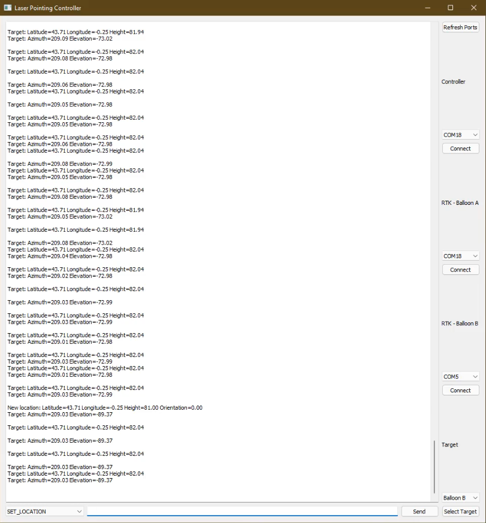

# Controller

This directory contains a controller software that can be run on any computer which is connected
to the Arduino Due via a serial connection.

The software allows sending telecommands and to forward received GPS locations
to the Arduino.

### Telecommands

| Name                  | Arguments                                  | Description                                                      |
|-----------------------|--------------------------------------------|------------------------------------------------------------------|
| PING                  | _None_                                     | Send a PING, expect a PONG back.                                 |
| GPS                   | latitude, longitude, altitude              | Set the GPS position of the pointing target.                     |
| CALIBRATE_MOTORS      | _None_                                     | Trigger the automatic calibration of the motors.                 |
| SET_LOCATION          | latitude, longitude, altitude, orientation | Set the position and zero pointing orientation of the structure. |
| SET_MOTOR_POSITION    | motor, angle                               | Manually set the motor position to a specific angle.             |
| SET_CALIBRATION_POINT | motor                                      | Set the calibration angle of a motor to the current angle.       |

### GPS forwarding
There can be two GPS receivers connected, whose received locations will be logged.
One of the two receivers can be selected as a target in the UI.
The locations received from this GPS receiver will then be forwarded to the Arduino.

### User Interface

