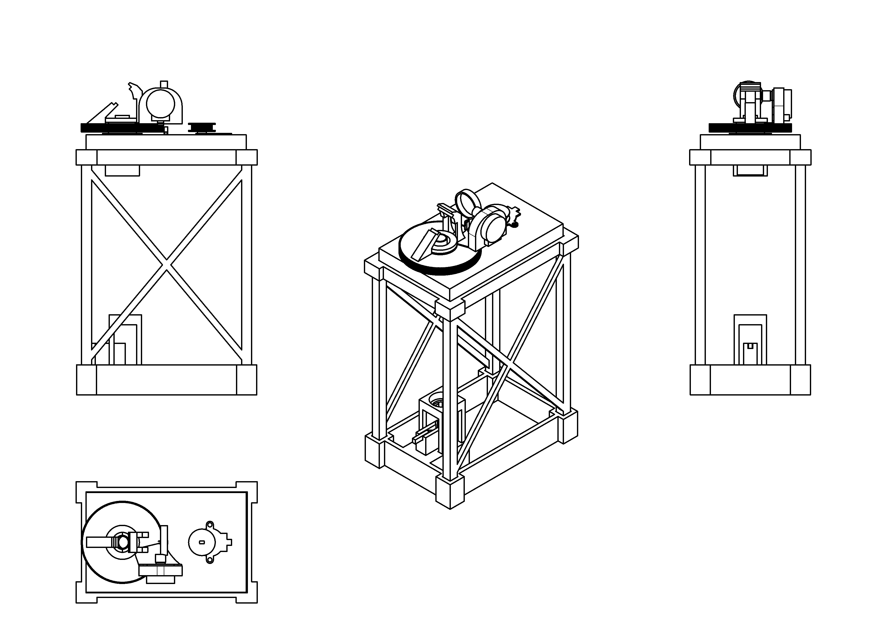
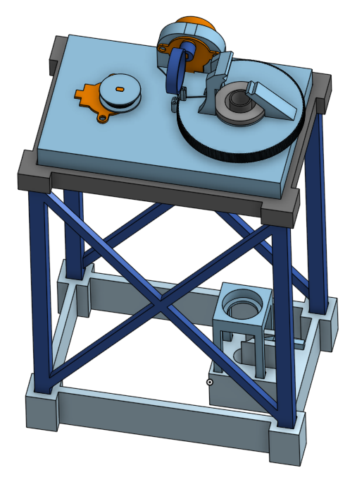
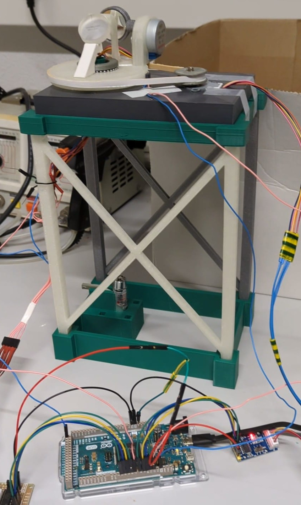
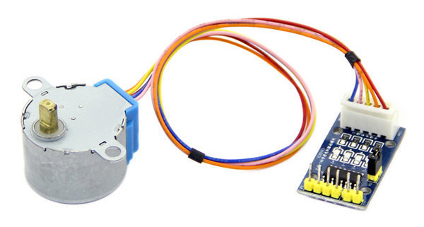

# Models of the structure of the pointing system

This directory contains 3D models of all components developed for the laser pointing structure.

### Full model

The [full model](Full Model.stl) contains all models assembled together.

| Model                                                                                | Real                                                                |
|--------------------------------------------------------------------------------------|---------------------------------------------------------------------|
|  |  |

### Motor

This is a placeholder for the [actual motors][Motor Datasheet].

[Motor Datasheet]: https://www.digikey.fr/fr/datasheets/mikroelektronika/mikroelektronika-step-motor-5v-28byj48-datasheet
